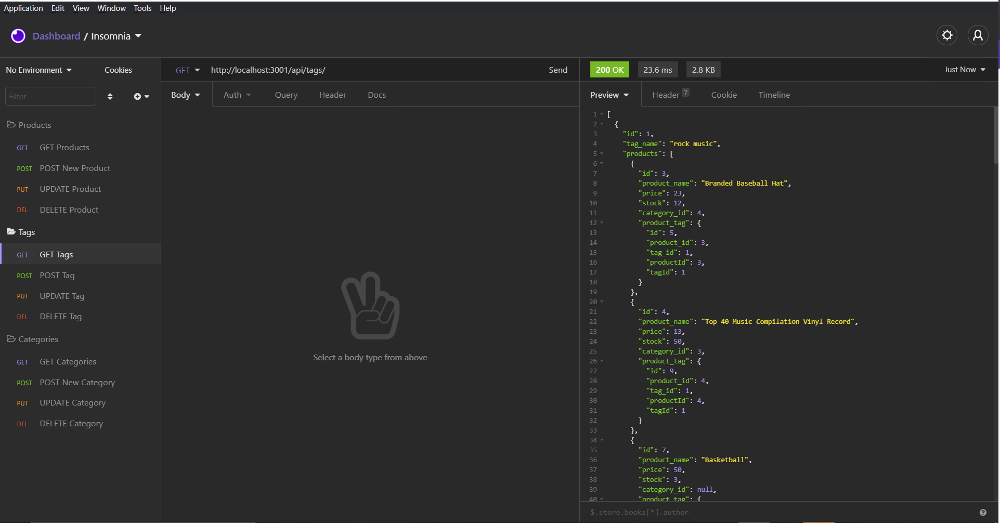
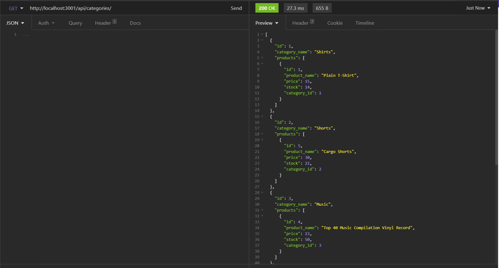

# BackEndCommerce
A project that utilizes Javascript, servers, MySQL Workbench, and Insomnia for back-end development.

## Link to Demonstration 

_https://drive.google.com/file/d/1IVbtBXq5AB6-VNSHatIfeqABfHl3tpLm/view?usp=sharing_

## Project Description

The purpose of this project is to use Insomnia, an application that allows design and interaction of APIs, to help code the back-end of an ecommerce website. Back-end javascript is mainly written for this project, which will prepare me to build a full-stack project with both front and back end technologies. Utilizing Insomnia also is important for understanding how http requests work, which is all then stored into a database (using MySQL workbench).

## Technologies

* Javascript
* Node.js
* MySql Workbench
* SQL
* Insomnia
* OOP
* Express
* Sequelize
# Installation Instructions

When cloning or forking this application, please pay attention to the .env.example file. This application uses the dotenv package so that private information can be stored since a password is required to connect to the MySQL server.

Use the following command to copy the env example file so you can replace the variable assignment in your .env file:

`cp .env.example .env`

To test the performance of the server-side javascript, you must __first__ seed the data; run `npm install` in the folder containing server.js, then run `npm run seed`.

## Important for first time use:

After connecting to the MySQL server, __you must__ use the queries in /db/schema.SQL before invoking the application if using for the first time. The queries can be copy and pasted as is in the SQL software.

# Usage

Once the above installation steps have been following, you can use `npm run watch` to start the server.

There are three different routes for this application:

* /api/products
* /api/categories
* /api/tags

You must create a POST, GET, PUT, and DELETE request for each route to work properly. PUT and UPDATE requests require a JSON body to submitted (refer to demonstration video).
## Screenshots

